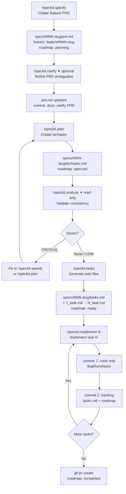

# spec-kit-preset-sdd-workflow

A [Spec Kit](https://github.com/github/spec-kit) preset that replaces the four core workflow commands — and customizes `clarify` and `analyze` — with an opinionated **Spec-Driven Development (SDD)** workflow.

---

## Standard spec-kit vs. with this preset

| Aspect | Standard spec-kit | + SDD Workflow Preset |
|--------|------------------|-----------------------|
| Feature spec file | `spec.md` (generic) | `prd.md` (product-focused, with RF-XX requirements) |
| Technical plan file | `plan.md` | `techspec.md` (interfaces, data model, testing strategy) |
| Task files | `tasks.md` (flat list) | `tasks.md` + individual `N_task.md` per task |
| Directory | `specs/NNN/` | `specs/NNN-[slug]/` (readable slug in folder name) |
| Branch management | Not managed | Auto-creates `feature/NNN-[slug]` |
| Approval gates | Not enforced | Required before every file save and every commit |
| Commit style | Not enforced | Conventional commits (`feat:`, `docs:`, `fix:`, `refactor:`) |
| Roadmap tracking | Not included | `docs/core/roadmap.md` auto-updated at every phase |
| Implementation commits | Single commit | Two-commit discipline: code first, tracking second |
| Architecture context | `memory/constitution.md` (principles) | `docs/core/sdd.md` (architecture, stack, conventions) |
| `clarify` command | Generic spec ambiguity scan | Adapted for PRD: scans RF-XX, user scenarios, business rules |
| `analyze` command | `spec/plan/tasks` consistency | `prd/techspec/tasks` consistency — `sdd.md` is authoritative |

---

## Workflow diagram



---

## Commands

| Command | Artifact produced | Description |
|---------|------------------|-------------|
| `/speckit.specify` | `specs/NNN-slug/prd.md` | Assigns a sequential number, drafts the feature PRD with RF-XX requirements, creates the branch and roadmap entry |
| `/speckit.clarify` | updates `prd.md` | Scans PRD for ambiguity, asks up to 5 targeted questions one at a time, encodes answers back into prd.md |
| `/speckit.plan` | `specs/NNN-slug/techspec.md` | Translates PRD into technical decisions — reads `sdd.md` when available |
| `/speckit.analyze` | report (no file) | Read-only consistency check across prd + techspec + tasks; `sdd.md` conflicts are always CRITICAL |
| `/speckit.tasks` | `tasks.md` + `N_task.md` | Presents high-level task list for approval, then generates individual task files with acceptance criteria |
| `/speckit.implement` | code | Implements one task at a time: test gate → human validation → code commit → tracking commit |

---

## How to install

### Prerequisites

- [Spec Kit CLI](https://github.com/github/spec-kit) installed
- A project initialized with `specify init`

### Install the preset only

```bash
specify preset add sdd-workflow \
  --from https://github.com/fabfdev/spec-kit-preset-sdd-workflow/archive/refs/tags/v1.1.0.zip
```

### Install preset + companion extension (recommended)

The extension adds product PRD, architecture document, and bug tracking. Together they form the full SDD workflow.

```bash
# replace core commands with SDD workflow
specify preset add sdd-workflow \
  --from https://github.com/fabfdev/spec-kit-preset-sdd-workflow/archive/refs/tags/v1.1.0.zip

# add inception and health commands
specify extension add sdd-workflow \
  --from https://github.com/fabfdev/spec-kit-extension-sdd-workflow/archive/refs/tags/v1.0.0.zip
```

---

## How to use

### Project inception (run once per project)

If you installed the companion extension:

```
/speckit.sdd-workflow.setup          → scaffolds docs/ structure
/speckit.sdd-workflow.product-prd    → docs/core/prd.md  (vision, personas, business rules)
/speckit.sdd-workflow.sdd            → docs/core/sdd.md  (stack, architecture, conventions)
```

These two files are optional but unlock the full intelligence of the preset commands — they read `prd.md` and `sdd.md` to avoid redundant questions and generate consistent output.

### Feature cycle (repeat per feature)

```
/speckit.specify   [description]     → specs/NNN-slug/prd.md
/speckit.clarify                     → refines prd.md  (optional, recommended)
/speckit.plan      [stack hints]     → specs/NNN-slug/techspec.md
/speckit.analyze                     → consistency report  (no files modified)
/speckit.tasks                       → specs/NNN-slug/tasks.md + N_task.md files
/speckit.implement [N]               → code  (repeat until all tasks done)
```

### Maintenance

```
/speckit.sdd-workflow.fix-bug [description]   → BUG-XXX → branch → fix → PR
```

---

## Usage example

```
# — Start a new feature —
/speckit.specify I want to add user login with email and password

  Agent: asks 5 scoping questions, drafts prd.md, waits for approval
  After approval:
    → specs/001-user-auth/prd.md
    → branch: feature/001-user-auth
    → roadmap: | User Auth | 001-user-auth | planning | 0/0 |

# — Refine ambiguities —
/speckit.clarify

  Agent: scans prd.md, identifies 2 unclear areas
  Q1: "Should sessions expire after inactivity? Recommended: Yes, 30 min — industry standard"
  Q2: "Password minimum length? Suggested: 8 characters — aligns with OWASP"
  After answers: updates prd.md, shows diff, commits on approval
    → commit: "docs: clarify PRD for 001-user-auth"

# — Plan the implementation —
/speckit.plan Use Node.js + Prisma, React + TanStack Query

  Agent: reads prd.md + sdd.md, drafts techspec.md
  Sections: architecture, data model, interfaces, testing strategy
  After approval:
    → specs/001-user-auth/techspec.md
    → roadmap: specced

# — Validate everything before building —
/speckit.analyze

  Report:
    MEDIUM | Coverage | prd.md RF-04 (rate limiting) has no task → add in /speckit.tasks
    No CRITICAL issues — safe to proceed

# — Break into tasks —
/speckit.tasks

  Agent proposes:
    1.0 Auth schema and Prisma migrations
    2.0 Login and session service
    3.0 React login form and validation
    4.0 Integration tests

  After approval → generates 4 task files + tasks.md
  roadmap: ready

# — Implement one task at a time —
/speckit.implement 1

  Agent: reads 1_task.md + techspec.md + sdd.md
  Implements, runs tests
  Presents: "Task 1.0 done. Tests: ✓ passing. Can you validate?"
  After validation:
    → commit 1: "feat: add auth schema and user migration"
    → commit 2: "docs: mark task 1.0 as done, roadmap 1/4"

/speckit.implement 2
/speckit.implement 3
/speckit.implement 4
  → last task: opens PR automatically
  → roadmap: completed
```

---

## How to remove

Removing the preset restores Spec Kit's original `specify`, `clarify`, `plan`, `analyze`, `tasks`, and `implement` commands. **Files already generated in `specs/` are not deleted.**

```bash
specify preset remove sdd-workflow
```

To also remove the companion extension:

```bash
specify extension remove sdd-workflow
```

---

## File structure generated

```
specs/
  001-user-auth/
    prd.md            ← feature requirements (RF-XX)
    techspec.md       ← technical decisions
    tasks.md          ← task checklist
    1_task.md         ← subtasks + acceptance criteria
    2_task.md
    ...
docs/
  core/
    roadmap.md        ← macro tracking (auto-updated)
    prd.md            ← product PRD (from companion extension)
    sdd.md            ← architecture doc (from companion extension)
  health/
    bugs/             ← BUG-XXX documents (from companion extension)
    debt/             ← TD-XXX documents (from companion extension)
```

---

## Roadmap status lifecycle

| Status | Triggered by |
|--------|-------------|
| `planning` | `/speckit.specify` |
| `specced` | `/speckit.plan` |
| `ready` | `/speckit.tasks` |
| `in_progress` | `/speckit.implement` (first task) |
| `completed` | `/speckit.implement` (last task) |

---

## Updating to a new version

```bash
specify preset remove sdd-workflow
specify preset add sdd-workflow \
  --from https://github.com/fabfdev/spec-kit-preset-sdd-workflow/archive/refs/tags/vX.Y.Z.zip
```

---

## Publishing a new version (maintainer)

```bash
# 1. edit commands/, bump version in preset.yml
git add . && git commit -m "chore: bump preset to vX.Y.Z"
git push

# 2. create release (no SSH needed)
gh release create vX.Y.Z \
  --repo fabfdev/spec-kit-preset-sdd-workflow \
  --title "vX.Y.Z" \
  --notes "What changed."
```

---

## Companion extension

This preset pairs with [`spec-kit-extension-sdd-workflow`](https://github.com/fabfdev/spec-kit-extension-sdd-workflow), which adds:

- `/speckit.sdd-workflow.setup` — scaffolds the full `docs/` structure
- `/speckit.sdd-workflow.product-prd` — creates `docs/core/prd.md`
- `/speckit.sdd-workflow.sdd` — creates `docs/core/sdd.md` (the most critical file)
- `/speckit.sdd-workflow.fix-bug` — registers bugs as `BUG-XXX`, creates branch, fixes, opens PR

---

## License

MIT
