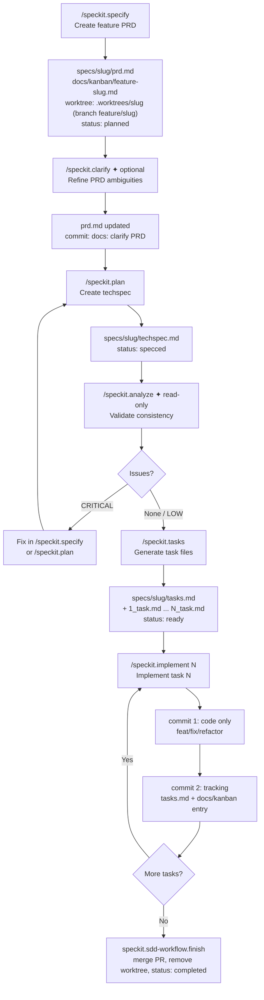

# spec-kit-preset-sdd-workflow

A [Spec Kit](https://github.com/github/spec-kit) preset that replaces the four core workflow commands — and customizes `clarify` and `analyze` — with an opinionated **Spec-Driven Development (SDD)** workflow.

---

## Standard spec-kit vs. with this preset

| Aspect | Standard spec-kit | + SDD Workflow Preset |
|--------|------------------|-----------------------|
| Feature spec file | `spec.md` (generic) | `prd.md` (product-focused, with RF-XX requirements) |
| Technical plan file | `plan.md` | `techspec.md` (interfaces, data model, testing strategy) |
| Task files | `tasks.md` (flat list) | `tasks.md` + individual `N_task.md` per task |
| Directory | `specs/NNN/` | `specs/[slug]/` (readable slug, no numeric prefix) |
| Isolation | Not managed | Auto-creates a dedicated git worktree (`.worktrees/[slug]`) on branch `feature/[slug]` |
| Approval gates | Not enforced | Required before every file save and every commit |
| Commit style | Not enforced | Conventional commits (`feat:`, `docs:`, `fix:`, `refactor:`) |
| Progress tracking | Not included | Local `docs/kanban/feature-[slug].md` (one markdown file per item) updated at every phase; `git log` is the history |
| Implementation commits | Single commit | Two-commit discipline: code first, tracking second |
| Architecture context | `memory/constitution.md` (principles) | `docs/core/sdd.md` (architecture, stack, conventions) |
| `clarify` command | Generic spec ambiguity scan | Adapted for PRD: scans RF-XX, user scenarios, business rules |
| `analyze` command | `spec/plan/tasks` consistency | `prd/techspec/tasks` consistency — `sdd.md` is authoritative |

---

## Workflow diagram



---

## Commands

| Command | Artifact produced | Description |
|---------|------------------|--------------|
| `/speckit.specify` | `specs/[slug]/prd.md` | Drafts the feature PRD with RF-XX requirements, creates a dedicated worktree (`.worktrees/[slug]`) on branch `feature/[slug]`, and registers it in `docs/kanban/feature-[slug].md` |
| `/speckit.clarify` | updates `prd.md` | Scans PRD for ambiguity, asks up to 5 targeted questions one at a time, encodes answers back into prd.md |
| `/speckit.plan` | `specs/[slug]/techspec.md` | Translates PRD into technical decisions — reads `sdd.md` when available |
| `/speckit.analyze` | report (no file) | Read-only consistency check across prd + techspec + tasks; `sdd.md` conflicts are always CRITICAL |
| `/speckit.tasks` | `tasks.md` + `N_task.md` | Presents high-level task list for approval, then generates individual task files with acceptance criteria |
| `/speckit.implement` | code | Implements one task at a time: test gate → human validation → code commit → tracking commit |

`clarify`, `plan`, and `tasks` also check whether the feature's branch is already checked out in another worktree before touching git — if so, they point you at the worktree path instead of failing with a raw git error.

To close out a finished feature (merge its PR, remove the worktree, update the kanban entry, return to `main`), or to see and switch between everything currently in progress, use the companion extension's `/speckit.sdd-workflow.finish` and `/speckit.sdd-workflow.worktrees` — see below.

---

## How to install

### Prerequisites

- [Spec Kit CLI](https://github.com/github/spec-kit) installed
- A project initialized with `specify init`

### Install the preset only

```bash
specify preset add sdd-workflow \
  --from https://github.com/fabfdev/spec-kit-preset-sdd-workflow/archive/refs/tags/v2.0.0.zip
```

### Install preset + companion extension (recommended)

The extension adds product PRD, architecture document, bug/tech-debt tracking, and worktree lifecycle commands (list, switch, finish). Together they form the full SDD workflow.

```bash
# replace core commands with SDD workflow
specify preset add sdd-workflow \
  --from https://github.com/fabfdev/spec-kit-preset-sdd-workflow/archive/refs/tags/v2.0.0.zip

# add inception, health, and worktree lifecycle commands
specify extension add sdd-workflow \
  --from https://github.com/fabfdev/spec-kit-extension-sdd-workflow/archive/refs/tags/v2.0.0.zip
```

---

## How to use

### Project inception (run once per project)

If you installed the companion extension:

```
/speckit.sdd-workflow.setup          → scaffolds docs/ structure, incl. docs/kanban/ (local tracking)
/speckit.sdd-workflow.product-prd    → docs/core/prd.md  (vision, personas, business rules)
/speckit.sdd-workflow.sdd            → docs/core/sdd.md  (stack, architecture, conventions)
```

These two files are optional but unlock the full intelligence of the preset commands — they read `prd.md` and `sdd.md` to avoid redundant questions and generate consistent output.

### Feature cycle (repeat per feature)

```
/speckit.specify   [description]     → specs/slug/prd.md, worktree .worktrees/slug on branch feature/slug
/speckit.clarify                     → refines prd.md  (optional, recommended)
/speckit.plan      [stack hints]     → specs/slug/techspec.md
/speckit.analyze                     → consistency report  (no files modified)
/speckit.tasks                       → specs/slug/tasks.md + N_task.md files
/speckit.implement [N]               → code  (repeat until all tasks done)
```

Run these from inside the feature's worktree (`cd .worktrees/slug`), or open a new Claude Code session pointed at that path — this lets you work on more than one feature at the same time without branch collisions.

### Closing a feature

With the companion extension installed:

```
/speckit.sdd-workflow.finish   → merges the PR (squash), removes the worktree, updates the kanban entry, returns to main
```

### Maintenance

```
/speckit.sdd-workflow.fix-bug [description]    → registers a bug, worktree on bugfix/[slug], fix → PR
/speckit.sdd-workflow.fix-debt [description]   → registers tech debt, worktree on refactor/[slug], resolution → PR
/speckit.sdd-workflow.worktrees                → lists everything in progress, lets you switch into one
```

---

## Usage example

```
# — Start a new feature —
/speckit.specify I want to add user login with email and password

  Agent: asks 5 scoping questions, drafts prd.md, waits for approval
  After approval:
    → specs/user-auth/prd.md
    → worktree: .worktrees/user-auth (branch feature/user-auth)
    → docs/kanban/feature-user-auth.md  (status: planned)

# — Refine ambiguities —
/speckit.clarify

  Agent: scans prd.md, identifies 2 unclear areas
  Q1: "Should sessions expire after inactivity? Recommended: Yes, 30 min — industry standard"
  Q2: "Password minimum length? Suggested: 8 characters — aligns with OWASP"
  After answers: updates prd.md, shows diff, commits on approval
    → commit: "docs: clarify PRD for user-auth"

# — Plan the implementation —
/speckit.plan Use Node.js + Prisma, React + TanStack Query

  Agent: reads prd.md + sdd.md, drafts techspec.md
  Sections: architecture, data model, interfaces, testing strategy
  After approval:
    → specs/user-auth/techspec.md
    → docs/kanban/feature-user-auth.md  (status: specced)

# — Validate everything before building —
/speckit.analyze

  Report:
    MEDIUM | Coverage | prd.md RF-04 (rate limiting) has no task → add in /speckit.tasks
    No CRITICAL issues — safe to proceed

# — Break into tasks —
/speckit.tasks

  Agent proposes:
    1.0 Auth schema and Prisma migrations
    2.0 Login and session service
    3.0 React login form and validation
    4.0 Integration tests

  After approval → generates 4 task files + tasks.md
  docs/kanban/feature-user-auth.md  (status: ready, tasks_total: 4)

# — Implement one task at a time —
/speckit.implement 1

  Agent: reads 1_task.md + techspec.md + sdd.md
  Implements, runs tests
  Presents: "Task 1.0 done. Tests: ✓ passing. Can you validate?"
  After validation:
    → commit 1: "feat: add auth schema and user migration"
    → commit 2: "docs: mark task 1.0 as done"  (kanban tasks_done: 1)

/speckit.implement 2
/speckit.implement 3
/speckit.implement 4
  → last task: opens PR automatically
  → docs/kanban/feature-user-auth.md  (status: in-review, pr: <url>)

# — Close it out —
/speckit.sdd-workflow.finish

  Agent: finds the open PR, confirms, squash-merges + deletes remote branch
  Removes .worktrees/user-auth, checks out main, pulls
  docs/kanban/feature-user-auth.md  (status: completed)
```

---

## How to remove

Removing the preset restores Spec Kit's original `specify`, `clarify`, `plan`, `analyze`, `tasks`, and `implement` commands. **Files already generated in `specs/` are not deleted.**

```bash
specify preset remove sdd-workflow
```

To also remove the companion extension:

```bash
specify extension remove sdd-workflow
```

---

## File structure generated

```
.worktrees/
  user-auth/            ← dedicated worktree, branch feature/user-auth
    specs/
      user-auth/
        prd.md            ← feature requirements (RF-XX)
        techspec.md       ← technical decisions
        tasks.md          ← task checklist
        1_task.md         ← subtasks + acceptance criteria
        2_task.md
        ...
docs/
  core/
    prd.md              ← product PRD (from companion extension)
    sdd.md              ← architecture doc (from companion extension)
  health/
    scan.md             ← health scan guide (from companion extension)
  kanban/
    README.md           ← schema + status lifecycle (from companion extension)
    feature-user-auth.md ← one file per work item: frontmatter + notes; git log is the history
```

---

## Status lifecycle

Tracked in `docs/kanban/feature-[slug].md` frontmatter (`status:`). The file is committed with the feature, so `git log docs/kanban/feature-[slug].md` is the full history.

| `status` | Triggered by |
|----------|-------------|
| `planned` | `/speckit.specify` |
| `specced` | `/speckit.plan` |
| `ready` | `/speckit.tasks` |
| `in-progress` | `/speckit.implement` (first task) |
| `in-review` | `/speckit.implement` (last task, PR opened) |
| `completed` | `/speckit.sdd-workflow.finish` (PR merged) |

`abandoned` is available at any point for work that is dropped.

---

## Migrating from v1.x (Notion)

v1.x tracked status and history in a Notion Kanban database. v2 tracks everything locally in `docs/kanban/`. If you have a v1.x project, install the companion extension v2 and run `/speckit.sdd-workflow.import-notion` once — it reads your existing Notion board and writes one `docs/kanban/<type>-<slug>.md` per item. After that, `.sdd-notion.json` and the Notion database are no longer used.

---

## Updating to a new version

```bash
specify preset remove sdd-workflow
specify preset add sdd-workflow \
  --from https://github.com/fabfdev/spec-kit-preset-sdd-workflow/archive/refs/tags/vX.Y.Z.zip
```

---

## Publishing a new version (maintainer)

```bash
# 1. edit commands/, bump version in preset.yml
git add . && git commit -m "chore: bump preset to vX.Y.Z"
git push

# 2. create release (no SSH needed)
gh release create vX.Y.Z \
  --repo fabfdev/spec-kit-preset-sdd-workflow \
  --title "vX.Y.Z" \
  --notes "What changed."
```

---

## Companion extension

This preset pairs with [`spec-kit-extension-sdd-workflow`](https://github.com/fabfdev/spec-kit-extension-sdd-workflow), which adds:

- `/speckit.sdd-workflow.setup` — scaffolds the full `docs/` structure, including `docs/kanban/` (local tracking)
- `/speckit.sdd-workflow.product-prd` — creates `docs/core/prd.md`
- `/speckit.sdd-workflow.sdd` — creates `docs/core/sdd.md` (the most critical file)
- `/speckit.sdd-workflow.fix-bug` — registers bugs in `docs/kanban/bug-[slug].md`, creates a worktree on `bugfix/[slug]`, fixes, opens a PR
- `/speckit.sdd-workflow.fix-debt` — registers tech debt in `docs/kanban/debt-[slug].md`, creates a worktree on `refactor/[slug]`, resolves it, opens a PR
- `/speckit.sdd-workflow.worktrees` — lists every active worktree (features, bugs, debt) with its kanban status, lets you switch into one
- `/speckit.sdd-workflow.finish` — merges the current worktree's PR, removes it, updates the kanban entry, returns to main
- `/speckit.sdd-workflow.import-notion` — one-time migration from a v1.x Notion board into `docs/kanban/`

---

## License

MIT
